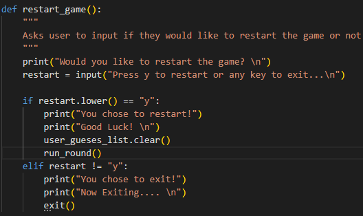

# Hangman
My Hangman is a python terminal based game, which runs through a mock terminal on Heroku 

The user tries to guess the randomly selected word before they run out of guesses.

[You can play the game live here!](https://python-hangman-game-cjfinan.herokuapp.com/)

## How to play

In my version of Hangman a random word is generated, the user has to guess one letter at a time
and if the letter is within the word it will then show up however, if they get it wrong
the program will then display how many lives you have left aswell as a visual representation.

Win the game by guessing the correct word before you lose all your lives.

## Features

- Welcome message
- User can clarify any rules if they are unsure
- Or user can go straight into playing the game

- Random word generated for each game

- Accepts user input
- Valids user input:
  - You cannot guess more than letter at a time
  - You cannot guess anything other than a letter between a-z
  - You cannot guess a letter that you have already guessed

- Displays all users incorrect guesses
- Displays number of lives
- Displays hangman image corrosponding to the number of lives

- Diplays winning message on correctly gussed word
- Gives user option to play a new game or to exit

## Testing

I have manually tested this project by:
- Passed my code through the PEP8 linter and confirmed there are no significant issues
- Pass invalid inputs through the input validator: two letters at once, integer instead of str, special characters
- Constantly tested through the terminal and through Herkoku

### Bugs

Solved Bugs
1. Before you could only win the game if the letters were guessed in the correct order, This was because i was comparing the exact order of the characters they entered and then compared it to the random word. Which looked like this "if correct_characters == selected_word:"
To get around thing i decided to loop through the letters of the random word and check if they were inside the correct characters vairable, turning a is_eqaul variable to true or false.

2. I had a bug where if the user restarted the game, it would not let them guess any of the letters that they had previously guessed in the game before. To fix this i added the .clear() method to the variable that contained all of the users guesses within the restart_game function.

3. I had one bug where everytime it asked the user for the input and displayed the correct amount of underscores it would end up adding another set of underscores, so each time the user tried to guess a letter the word they were guessing doubled. To fix this i had to move my outcome variable, which determines what is displayed to the user, into the while loop as before it was sitting inside.
Here is a representation of the bug i was getting:

This is the code that solved the bug:

### Remaining Bugs
- No bugs remaining

### Validator Testing
- PEP8
  - No errors were returned from PEP8online.com

## Deployment
This project was deplayed through Heroku.
- Steps for deployment
  - Fork or clone this repository
  - Create new Heroku app
  - Set the buildbacks to Python and NodeJS in that order
  - Link the Heroku app to the repository
  - Click on Deploy

## Credits
- Code institute for the deployment terminal
- Code institute for deployment steps